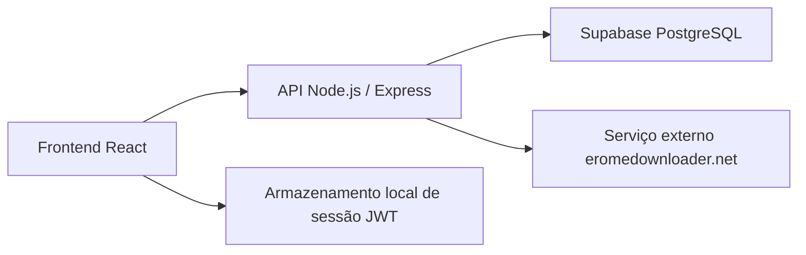
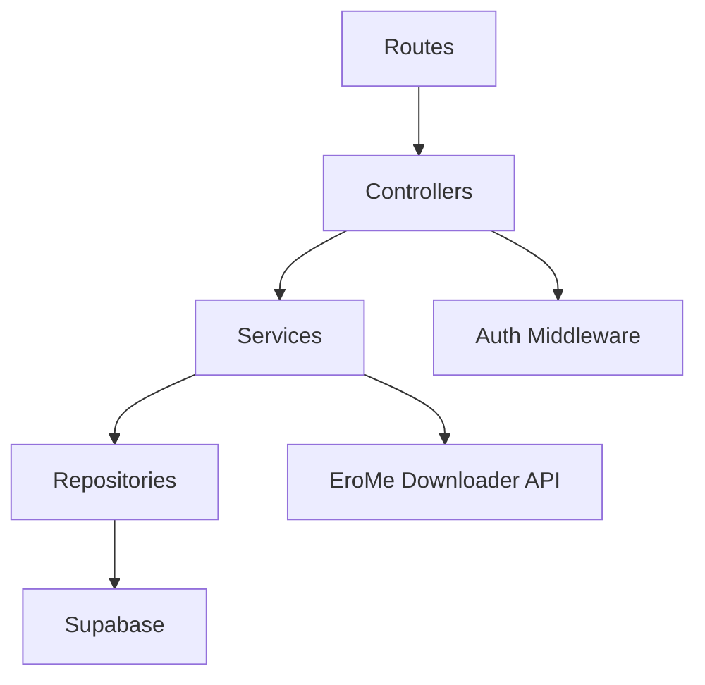
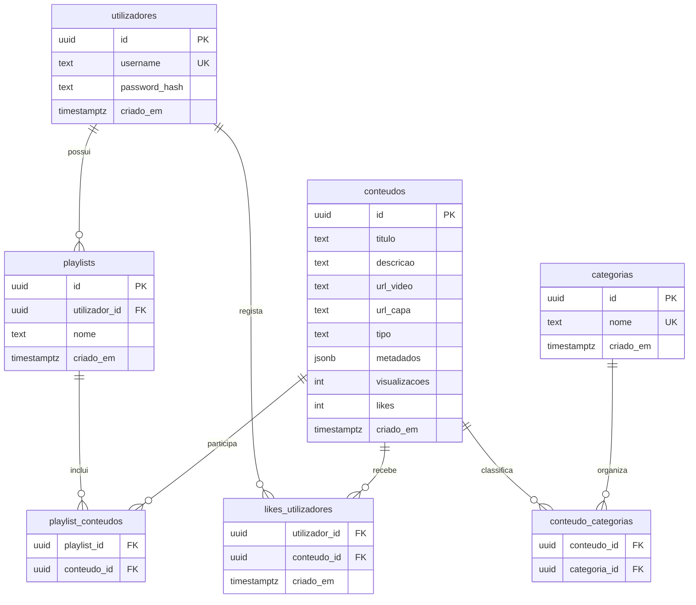

## 1. Desenho de Arquitetura


## 2. Descrição de Tecnologias
- Frontend: React 18 + Vite + React Router + CSS customizado orientado por tokens de tema
- Inicialização: Vite
- Backend: Node.js + Express 4
- Autenticação: JWT + bcrypt
- Base de dados: Supabase PostgreSQL
- Acesso ao banco: `@supabase/supabase-js`
- Validação e segurança: middlewares Express, parsing JSON, headers básicos, checagem de token para rotas privadas

## 3. Definição de Rotas
| Rota | Finalidade |
|-------|---------|
| `/` | Página pública com feed e seções de sequels |
| `/login` | Autenticação por username e password |
| `/admin` | Painel privado sem link no menu principal |

## 4. Definições de API
### 4.1 Autenticação
```ts
type RegisterRequest = {
  username: string;
  password: string;
};

type LoginRequest = {
  username: string;
  password: string;
};

type AuthResponse = {
  token: string;
  user: {
    id: string;
    username: string;
  };
};
```

### 4.2 Integração de Álbum
```ts
type FetchAlbumRequest = {
  url: string;
};

type MediaItem = {
  sourceUrl: string;
  coverUrl?: string | null;
  mediaType: "video" | "photo";
  width?: number | null;
  height?: number | null;
  providerId?: string | null;
};

type FetchAlbumResponse = {
  albumUrl: string;
  items: MediaItem[];
  raw?: unknown;
};
```

### 4.3 Persistência Administrativa
```ts
type SaveVideoNormalRequest = {
  descricao?: string | null;
  urlVideo: string;
  urlCapa?: string | null;
  categoriasIds: string[];
  coordenadas?: {
    width?: number | null;
    height?: number | null;
  } | null;
};

type SaveSequelRequest = {
  albumUrl: string;
  descricao?: string | null;
  categoriasIds: string[];
  items: Array<{
    urlVideo: string;
    urlCapa?: string | null;
    mediaType: "video" | "photo";
    width?: number | null;
    height?: number | null;
  }>;
};
```

## 5. Diagrama de Arquitetura do Servidor


## 6. Modelo de Dados
### 6.1 Definição do Modelo


### 6.2 Linguagem de Definição de Dados
```sql
create extension if not exists "pgcrypto";

create table if not exists public.utilizadores (
  id uuid primary key default gen_random_uuid(),
  username text not null unique,
  password_hash text not null,
  criado_em timestamptz not null default now()
);

create table if not exists public.categorias (
  id uuid primary key default gen_random_uuid(),
  nome text not null unique,
  criado_em timestamptz not null default now()
);

create table if not exists public.conteudos (
  id uuid primary key default gen_random_uuid(),
  titulo text,
  descricao text,
  url_video text not null,
  url_capa text,
  tipo text not null check (tipo in ('video_normal', 'sequel')),
  metadados jsonb not null default '{}'::jsonb,
  visualizacoes integer not null default 0,
  likes integer not null default 0,
  criado_em timestamptz not null default now()
);

create table if not exists public.conteudo_categorias (
  conteudo_id uuid not null references public.conteudos(id) on delete cascade,
  categoria_id uuid not null references public.categorias(id) on delete cascade,
  primary key (conteudo_id, categoria_id)
);

create table if not exists public.playlists (
  id uuid primary key default gen_random_uuid(),
  utilizador_id uuid not null references public.utilizadores(id) on delete cascade,
  nome text not null,
  criado_em timestamptz not null default now()
);

create table if not exists public.playlist_conteudos (
  playlist_id uuid not null references public.playlists(id) on delete cascade,
  conteudo_id uuid not null references public.conteudos(id) on delete cascade,
  primary key (playlist_id, conteudo_id)
);

create table if not exists public.likes_utilizadores (
  utilizador_id uuid not null references public.utilizadores(id) on delete cascade,
  conteudo_id uuid not null references public.conteudos(id) on delete cascade,
  criado_em timestamptz not null default now(),
  primary key (utilizador_id, conteudo_id)
);

create index if not exists idx_conteudos_tipo on public.conteudos(tipo);
create index if not exists idx_conteudos_criado_em on public.conteudos(criado_em desc);
create index if not exists idx_playlists_utilizador on public.playlists(utilizador_id);
create index if not exists idx_likes_conteudo on public.likes_utilizadores(conteudo_id);
```
