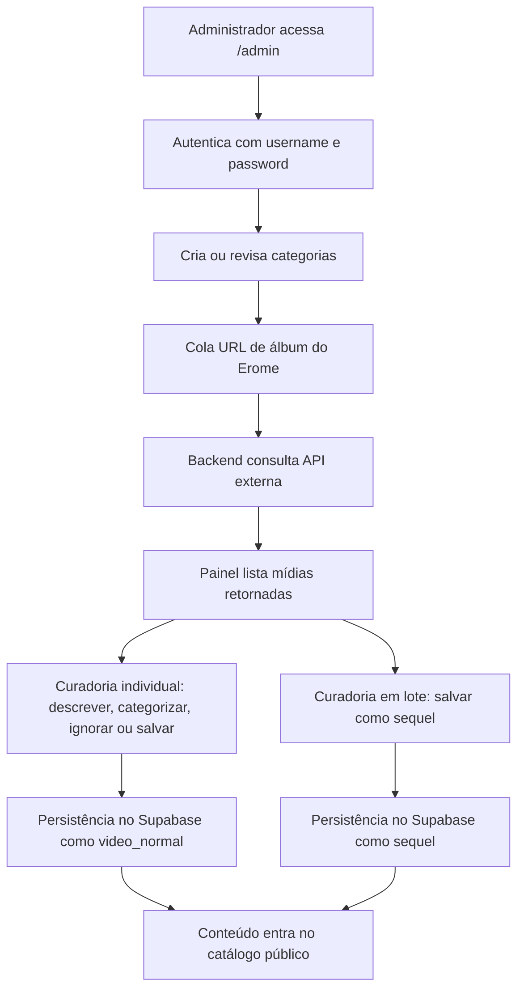

## 1. Visão Geral do Produto
SplashWet é uma plataforma web mobile-first para consumo rápido de vídeos verticais e coleções do tipo sequel, com foco em leveza, ingestão ágil e administração privada de conteúdo.
- Resolve a necessidade de publicar, categorizar e organizar mídia vertical com fluxo de curadoria simples e backend enxuto.
- O valor principal está em combinar reprodução rápida, taxonomia flexível e um painel administrativo oculto com ingestão sem atrito.

## 2. Funcionalidades Centrais

### 2.1 Papéis de Utilizador
| Papel | Método de Acesso | Permissões Centrais |
|------|-------------------|---------------------|
| Visitante | Acesso público | Navegar por conteúdos públicos e galerias |
| Utilizador autenticado | Username e password | Criar playlists, dar likes, gerir sessão |
| Administrador | Rota privada e JWT válido | Criar categorias, ingerir álbuns, salvar conteúdos e sequels |

### 2.2 Módulos Funcionais
1. **Home mobile-first**: feed vertical rápido, navegação mínima, blocos de destaques e galerias sequel.
2. **Autenticação customizada**: registo e login por `username` e `password`, sem menu público para admin.
3. **Painel `/admin`**: categorias, ingestão individual de mídias, ingestão agrupada de sequels.
4. **Camada de backend**: autenticação JWT, integração com Supabase, proxy para API externa EroMe Downloader.

### 2.3 Detalhamento de Páginas
| Nome da Página | Módulo | Descrição da Funcionalidade |
|-----------|-------------|---------------------|
| Home | Feed vertical | Exibe vídeos tipo `video_normal` com carregamento leve, visual escuro e foco no conteúdo |
| Home | Seção de galerias | Exibe conteúdos tipo `sequel` organizados por agrupamento visual |
| Login | Formulário customizado | Permite autenticação por username e password com retorno de JWT |
| Admin | Gestão de categorias | Cria e elimina categorias persistidas no banco |
| Admin | Puxar conteúdo | Recebe URL de álbum, consulta backend e lista mídias retornadas |
| Admin | Curadoria por item | Permite descrever, categorizar, ignorar ou salvar cada mídia individual |
| Admin | Adicionar sequels | Agrupa todas as mídias do álbum em uma coleção única do tipo `sequel` |

## 3. Fluxos Centrais
O administrador autentica-se, entra manualmente na rota `/admin`, cria categorias se necessário e cola uma URL de álbum do Erome. O backend consulta a API externa, devolve a lista de mídias e o painel permite curadoria individual ou por álbum inteiro. Após confirmação em modal quadrado, os dados são persistidos no Supabase e passam a compor o catálogo público.

O utilizador comum pode autenticar-se com username e password, dar likes, montar playlists e navegar entre vídeos normais e galerias sequel, sempre em interface mobile-first, escura e extremamente direta.

## 4. Design de Interface
### 4.1 Estilo Visual
- Tema obrigatório: modo escuro absoluto com fundo `#000000`
- Cores de destaque: `#ff1e9d` e `#00fff7`
- Botões, inputs, cards, modais e containers: cantos estritamente retos, sem qualquer arredondamento
- Estética: brutalista, minimalista, crua, com linhas fortes, contraste alto e hierarquia visual seca
- Tipografia: display marcante e corpo legível, sem aparência genérica; foco em peso tipográfico e espaçamento apertado
- Ícones: traço simples, geométrico, monocromático ou com destaques em rosa/ciano

### 4.2 Visão de UI por Página
| Nome da Página | Módulo | Elementos de UI |
|-----------|-------------|-------------|
| Home | Feed vertical | Colunas simples, vídeo ocupando a maior área, metadata enxuta, indicadores de interação laterais |
| Home | Blocos sequel | Grades retas, thumb dura, legendas mínimas e divisórias com linhas sólidas |
| Login | Formulário | Inputs escuros quadrados, labels em caixa alta, feedback textual objetivo |
| Admin | Abas principais | Navegação tabular com estados ativos em rosa e hover em ciano |
| Admin | Lista de mídias | Cartões quadrados empilhados, player, descrição, seleção múltipla e ações separadas |
| Admin | Modal de confirmação | Overlay escuro, caixa rígida sem sombra suave, botões de ação contrastantes |

### 4.3 Responsividade
- Estratégia principal: mobile-first com adaptação fluida para tablet e desktop
- Área de conteúdo estreita e legível em telemóveis, com colapsos simples e sem excesso de colunas
- Alvos de toque amplos, espaçamento consistente e rolagem vertical prioritária
- Em desktop, o painel admin utiliza duas colunas apenas quando houver ganho real de produtividade
